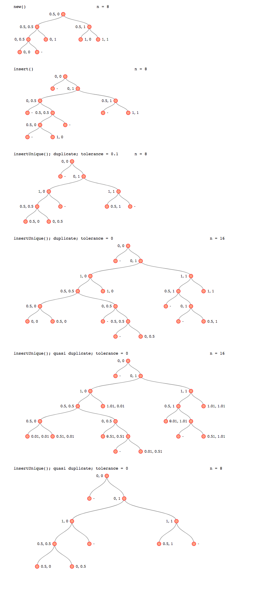

# k-d Tree in Javascript

This code was originally lifted from [ubilabs](https://github.com/ubilabs/kd-tree-javascript).

I can't remember exactly, but I think I had to make some adaptations to my project and I spent time tracing and testing it to make sure it worked properly. [Rendering index trees with d3](https://github.com/selkovjr/web-gui-snippets/tree/master/d3-binary-tree) proved to be very helpful in that process.

One of the adaptations I think I made was a distance metric abstraction, which I used to accommodate my visible stars test (it rendered ~5000 poins in a map widget, and the test highlighted a group of stars in the vicinty of the mouse pointer).

## A screenshot of test output:

