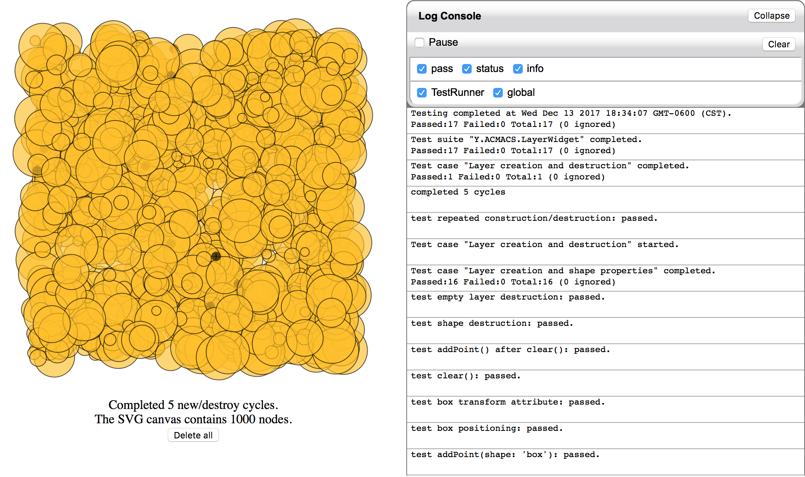

# Layer widget leak test

This test creates and destroys a few different node types (various point shapes) and then does several create/destroy cycles for sets of 1000 nodes at a time.

The purpose of this test, besides testing node rendering, is to exert some load on the browser with a view to checking residual memory use after the cycle is complete.

